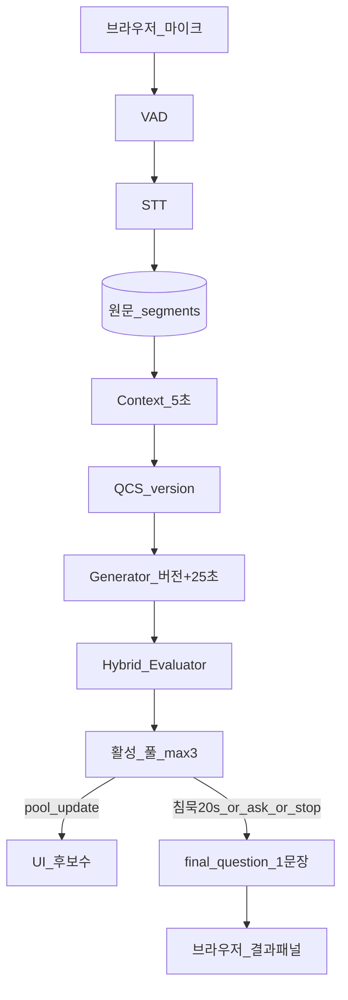

# 2026-09-18 작업 정리

> 브랜치: `develop_2`  
> 범위: web → realtime 단일 경로 고정, 배포 뼈대, 세션 방어, 파이프라인 최적화,  
> 최종 질문 UX(침묵/요청), 질문 품질 A/B·3-way 실험 및 제품 가설 재정리

---

## 1. 아키텍처 정리

- **활성 경로:** `apps/web` ↔ `services/realtime` 만 유지
- **제거:** TypeScript `services/extract`, `services/engine` 및 BFF `/api/extract`, `/api/diagnose`
- **contracts `0.2.0`:** Extract API 타입 제거, `Diagnosis*` / `RealtimeSession*` 정리
- **문서:** `INFRASTRUCTURE.md`·`README.md` 현행화, `KICKOFF.md`·`MVP2.md`는 ARCHIVE 표시

통신 요약:

```text
Browser
  ├── WS + session_token ──► realtime /v1/realtime   (녹음)
  └── BFF
        ├── /api/health
        ├── /api/realtime/session → /v1/session
        └── /api/realtime/text    → /v1/text
```

---

## 2. 배포 / Docker

| 항목 | 내용 |
|------|------|
| `services/realtime/Dockerfile` | FastAPI realtime 이미지 |
| `apps/web/Dockerfile` | Next 프로덕션 이미지 |
| `docker-compose.yml` | web + realtime 함께 기동 |
| Env | `CORS_ORIGIN`, `NEXT_PUBLIC_REALTIME_WS_URL`(배포 시 `wss://`), `REALTIME_API_KEY` |

로컬:

```bash
docker compose up --build
# 또는 start-local / 수동 realtime:8765 + npm run dev:web
```

공개 배포 체크리스트:

1. realtime 호스트 상시 기동
2. HTTPS + `wss://` (녹음)
3. web·realtime에 동일 `REALTIME_API_KEY`
4. `CORS_ORIGIN` = 실제 web origin

---

## 3. 세션·남용 방어 (3-B)

- `POST /v1/session` → 단회용 `session_token` (TTL 기본 120초)
- WS `start`에 토큰 필수
- `MAX_AUDIO_SESSIONS` (기본 2) 동시 녹음 상한
- `REALTIME_API_KEY` 설정 시 `/v1/text`·`/v1/session` Bearer 필수
- 웹: 녹음 시작 전 `/api/realtime/session`으로 토큰 발급

---

## 4. 시스템 흐름 변경 (핵심)

한 줄: **백그라운드에서는 계속 만들고 모아 두고, 화면의 최종 질문 1문장은 침묵·사용자 요청·종료 시에만 꺼낸다.**  
(`생성 ≠ 노출`)

### 4.1 이전 → 이후

| | 이전 | 이후 (오늘 구현) |
| --- | --- | --- |
| 평가 후 UI | `questions`로 활성 목록을 자주 push | 풀만 갱신 (`pool_update`, 후보 수) |
| 최종 UX | 목록 갱신에 가까움 | **`final_question` 1문장만** 표시 |
| 자동 노출 | 웹 침묵 트리거 약함/없음 | 서버 침묵 **≥ 20초** |
| 수동 노출 | 텍스트 분석 등과 섞임 | WS **`ask`** («지금 질문 요청») |
| Generator | ~30초 고정 주기에 가깝 | **Context version↑ + 최소 25초** |
| Evaluator | LLM 중심 채점에 가깝 | **Hybrid** (규칙 하드 + LLM soft) |
| Stop | 종료 시 직렬 LLM 재실행 가능 | 활성 풀 있으면 **즉시 1문장** |

### 4.2 이후 파이프라인

```text
브라우저 마이크
  → VAD → STT → SQLite 원문 segments
  → Context (~5초, 새 segment 시) → QuestionContextState (version++)
  → Generator (version↑ AND ≥25초) → 후보 생성·저장
  → Hybrid Evaluator → 활성 풀 ≤3
       │
       ├─ pool_update ──► UI (후보 수만, 최종 문장 아님)
       │
       └─ final_question ──► UI (1문장)
              트리거: 침묵≥20초 | ask | stop
```



### 4.3 최종 노출 규칙

```text
[A] 침묵 ≥ 20초 AND 활성 질문 ≥ 1  → 최고점 1문장 (같은 침묵 구간 중복 방지)
[B] 사용자 ask                     → 즉시 최고점 1문장 (없으면 없음/대기)
[C] 녹음 stop + 풀 있음            → 즉시 1문장
그 외 말하는 중                    → 최종 질문 안 띄움 (생성은 백그라운드)
```

### 4.4 설계 확정값

| 항목 | 값 |
|------|-----|
| 침묵 T | `SILENCE_TRIGGER_SECONDS=20` (서버 감지) |
| Generator | Context version↑ + `GENERATOR_MIN_INTERVAL_SECONDS=25` |
| Evaluator | Hybrid (길이·의문형·근거·금칙·중복 규칙 + 정보이득·가정·stale LLM) |
| 사용자 요청 | 항상 가능 (`ask`) |
| WS 이벤트 | `pool_update` ≠ `final_question` |

원문 append + QCS 버전 갱신 저장 방식은 **유지**.

---

## 5. 최종 질문 UX · Hybrid 평가 (구현 체크)

| 항목 | 내용 |
|------|------|
| 표시 vs 생성 분리 | 백그라운드 `pool_update` / 화면 `final_question` |
| 침묵 트리거 | 서버 측 20초 → 최고점 1문장 |
| 사용자 요청 | WS `ask` |
| 생성 게이트 | Context version↑ + 최소 25초 |
| Hybrid evaluator | 코드 하드 필터 + LLM soft score |
| Stop 시 | 활성 풀 있으면 즉시 노출 |

---

## 6. 파이프라인 최적화

| 변경 | 효과 |
|------|------|
| 후보 **8 → 5** | 생성 지연·토큰 감소, category 3종 유지 |
| ask 시 풀 비면 **즉시 analysis** | 빈 반려 감소 |
| Context/Generate **이벤트+debounce** | 5초 맹목 폴링 대체 |
| Reeval은 **context version 변경 시만** | 불필요 재채점 감소 |
| 재평가 evidence 완화 + **옛 질문 만료** | lag≥3 또는 `topic_changed` → EXPIRED |
| select_top 초과분 **parked(CANDIDATE)** | 영구 REJECT/Jaccard 오염 완화 |
| Evaluator **compact payload** | 토큰·비용 절감 |
| STT: OpenAI 전역락 해제, utterance 큐 max 8 | 동시성·적체 완화 |
| 클라이언트 **RMS 게이트** | 침묵 PCM 미전송 |
| soft threshold **top-k 기각** (절대 기준 유지) | Judge/반려 스토리 유지 |

---

## 7. 질문 품질 실험 (A/B · 3-way)

동일 모델: `gpt-4o-mini`

### 7.1 구성

| 조건 | 내용 |
|------|------|
| A Naive | “좋은 질문 3개” 일반 촉진 프롬프트 |
| B Eval-aligned | 정보이득·가정표면화·operator/category를 프롬프트에 넣은 1샷 |
| C Pipeline | Context → Generate → Hybrid evaluate → Select(≤3) |

- 픽스처: `fixtures/quality_ab/` (성급한 결정, 증상 처방, 과잉 커밋, 좁은 탐색, 조율 드리프트)
- 스크립트: `services/realtime/scripts/compare_question_quality.py`, `compare_three_way.py`
- 결과: `compare_question_quality.out.txt`, `compare_three_way.out.txt`

### 7.2 관찰

- **A vs B:** 프롬프트만 맞춰도 촉진형 → 전제/기준/반사실로 톤이 크게 바뀜
- **B vs C:** 최종 문장 품질·주제는 **대체로 비슷**. C의 8→필터→3이 문장상 뚜렷한 우위를 못 보여줌
- C의 체감 차별은 문장 마법보다 **점수/배지·선별 로그** 쪽
- 따라서 “거르는 파이프라인”의 이득은 **이번 샘플에서 증명되지 않음** (B도 비슷한 3개를 바로 냄)

### 7.3 제품 가설 재정리

| 가설 | 판정 |
|------|------|
| 더 똑똑한 질문 문장이 핵심 가치 | △ — 평가형 프롬프트 LLM으로 상당 부분 복제 가능 |
| 실시간 질문 자동화(언제·몇 개·침묵/요청)가 핵심 | ○ — 프롬프트만으로 대체하기 어려운 제품 레이어 |
| 추출·생성·평가 분리가 품질에 필수 | ✕ (현 시점) — MVP 검증엔 과함 |
| 퀄리티 + 속도 + API 비용 균형 | **희소 호출 + 평가형 1샷(질문 1개) + 침묵/요청 게이트** |

권장 방향(후속):

```text
STT → (로컬) 변화/쿨다운 게이트 → 필요할 때만 평가형 LLM 1샷 → 침묵/요청 시 1문장 표시
```

문장 퀄리티를 더 올리려면 파이프라인 확장보다 **결정 상태 추출·결정변경 1질문·슬롯 강제·조직 메모리**가 우선.

---

## 8. 비용 (현 설정 추정)

모델: `gpt-4o-mini` + `gpt-4o-mini-transcribe`

| 시나리오 | 대략 |
|----------|------|
| 텍스트 1회 | ~$0.003 (₩4) |
| 녹음 5분 | ~$0.02 (₩30) |
| 녹음 10분 | ~$0.04–0.07 |
| 심사일 중간 사용 | 수백 원~1천 원대 |

백그라운드 다단 LLM을 얇은 1샷으로 줄이면 위 상한은 더 내려갈 여지 있음.

---

## 9. 테스트·스모크

- realtime 유닛테스트: session gate, parked select, evidence reeval, compact evaluator 등
- `npm run smoke` → `/health`, `/v1/session`, `/v1/text` (+ 선택적 web BFF)
- 품질 비교 스크립트는 API 키 필요 (수동 실행)

---

## 10. 의도적 미포함 / 후속

- 프론트 녹음 실패 복구 UX (3-A) — 미실시
- 프리셋·톤 다이얼·샘플 원클릭 UI — 미실시
- top-k threshold — 기각
- MediaRecorder 이중 캡처 제거 등 Low micro — 미실시
- **얇은 파이프라인(평가형 1샷)으로 realtime 재설계** — 실험 결론만, 코드 전환 미실시
- Blind 사람 평가(결정 변경률) — 미실시

---

## 주요 파일

- `services/realtime/src/q_agent_realtime/server.py`
- `services/realtime/src/q_agent_realtime/questions.py`
- `services/realtime/src/q_agent_realtime/session_gate.py`
- `apps/web/src/app/page.tsx`, `apps/web/src/app/api/realtime/session/`
- `docker-compose.yml`, `*/Dockerfile`
- `fixtures/quality_ab/*`
- `services/realtime/scripts/compare_*.py`, `compare_*.out.txt`
- `docs/INFRASTRUCTURE.md`, `README.md`, `docs/MVP2.md`(ARCHIVE)
