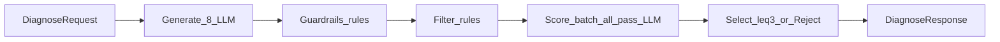

# Q-Agent Engine — 스택 · 로직 · 로드맵 (확정)

> 대상: `services/engine` / 브랜치 `feat/engine-pipeline`  
> 목표 지연: **p50 3~5초, p95 ≤ 8초** (질문 타이밍 = 제품 가치)  
> 대외 API: `POST /v1/diagnose` 단일 유지  
> 관련: [KICKOFF.md](./KICKOFF.md) §2.3, [최종_기획안.md](./최종_기획안.md)

---

## 1. 설계 원칙

1. **LLM 왕복 최소화** — 기본 **2콜** (Generate 1 + Score 배치 1)
2. **다양성은 생성에서, 품질 컷은 규칙에서** — Generate 8개 → Guard/Filter(규칙) → 통과분 **전원** 배치 채점
3. **Filter/Guard에 개수 상한 없음** — 통과한 질문은 모두 Score로
4. **Depth/Tone 재작성 LLM 없음** — 생성 시 톤·깊이 제약 + 규칙 감점만
5. **질 유지** — EVPI(가상 답변 → 다음 행동 변화)는 유지하되 **배치 1콜**로 전원 채점



---

## 2. 스택 (확정)

| 층 | 선택 |
| --- | --- |
| 런타임 | Node 20+ / Express / TypeScript (기존 골격) |
| LLM | OpenAI API — 기본 `gpt-4o-mini` (생성·채점 동일, 필요 시 채점만 상위 모델) |
| 클라이언트 | `openai` 공식 SDK |
| 스키마 | `zod` → `@q-agent/contracts` 매핑 |
| 프롬프트 | `services/engine/prompts/*.ts` + `prompt_version` |
| 설정 | `OPENAI_API_KEY`, `ENGINE_MODE=mock\|live`, `ENGINE_MODEL_*`, 임계값 env |
| 테스트 | fixture 골든셋 + `npm run smoke` |
| 배포 | Railway / Render (engine 단독), 키는 대시보드만 |

**제외:** LangChain/LangGraph, RAG, Python 재작성, 후보별 순차 EVPI, depth/tone LLM 재작성

**모드**

- `mock`: 키 없이 결정론적 파이프라인 (통합·smoke)
- `live`: OpenAI 2콜 파이프라인

---

## 3. 개수 정책 (확정)

| 단계 | 개수 | 비고 |
| --- | --- | --- |
| Generate | **8** | 다양성 (operator/category/PREG 슬롯 강제) |
| Guard + Filter 후 | **상한 없음** | 통과분 전부 Score |
| Score | **filter 통과 전원** | 배치 LLM **1콜** |
| 최종 출력 | **≤ 3** 또는 **rejected** | 계약 `max_questions` 기본 3 |

```text
n_generate = 8
n_score    = count(filter_pass)   # no cap
n_output   = min(3, count(final >= THRESHOLD))
if n_score == 0 → rejected (또는 재생성 최대 1회 후 재시도)
```

배치 채점에서 3개 vs 8개 전원은 **호출 수 동일**, 토큰만 소폭 증가. 상한보다 **중복 제거 품질**이 우선.

---

## 4. 단계별 로직

### 4.1 Generate (LLM 1콜)

**목적:** 다양하고, 이미 톤·깊이가 갖춰진 후보 8개.

**프롬프트 제약**
- 출력 JSON only, 후보 **정확히 8개**
- operator 5종 **최소 1회씩** (나머지 3은 preset 가중)
- category `blind_spot` / `essence` / `expansion` **각 ≥ 1**
- 동일 `preg_trigger` ≤ 2
- `tone`(1~4)을 **문장에 즉시 반영** (후단 재작성 없음)
- 얕은 확인·정의형 금지 → 기준/가정/반증/리프레이밍 수준
- 인신공격·유도·예/아니오 추궁 금지

**프리셋**
- `decision`: 판단 기준, trade-off, 반증
- `problem`: 문제정의, 가정, reframing

**입력 절약:** transcript가 길면 최근 N턴 + 선행 요약 일부만 주입.

**출력 필드:** `id`, `text`, `preg_trigger`, `operator`, `category`, `depth_hint`(선택)

---

### 4.2 Guardrails (규칙만, LLM 0)

Generate 직후 적용. 위반 시 **drop**.

| 코드 | 내용 |
| --- | --- |
| G1 | 인신공격·책임 추궁·비난 |
| G2 | 유도 질문 (미검증 전제 주입) |
| G3 | 닫힌 예/아니오 심문형 |
| G4 | 욕설·차별 금칙 |
| G5 | 회의 무관 잡담 |
| G6 | 허용 operator 외 |

구현: RegExp + 금칙 리스트.

---

### 4.3 Filter (규칙만, LLM 0)

Guard 통과분 대상. **개수 제한 없음.**

| 코드 | 내용 |
| --- | --- |
| F1 | 의문 형태, 길이 15~120자 |
| F2 | 평서·명령만 있는 문장 제외 |
| F3 | 닫힌 추궁 패턴 제외 |
| F4 | 최근 윈도우/프리셋과 粗 관련성 (핵심 토큰 겹침) |
| F5 | 최근 N턴(기본 12)과 비중복 (토큰 Jaccard 등) |
| F6 | **후보 간** 유사 중복 제거 (유사도 높은 쪽 drop) |

유사도: MVP는 임베딩 API 없이 **토큰 Jaccard**.  
`pipeline.candidates_after_filter` = 생존 수.

생존 0 → `rejected` 또는 Generate **재시도 최대 1회** (총 LLM ≤ 3).

---

### 4.4 Score — EVPI 배치 (LLM 1콜, 전원)

**목적:** filter 통과분 **전부**에 대해 “답이 다음 행동/결론을 바꾸는가” 채점.

**방식:** 후보별 순차 호출 금지. **한 번의 배치 JSON**으로 전원 채점.

각 id에 대해 모델이 산출:
- `info_gain` (0~1) — norm 유일: 결정/다음 액션 변화 가능성
- `hypothetical_answer_summary`
- `action_before` / `action_after` (짧게)
- `rationale`

규칙 측:
- `relevant`, `non_redundant`: filter 통과 반영 고정/가산
- `depth`: `depth_hint` + 키워드 규칙 가감
- `final = 0.7*info_gain + 0.15*depth + 0.15*relevant_fixed` (가중치는 env로 조절 가능)

`badges`: 높은 축만 라벨.

---

### 4.5 Depth · Tone (후단 LLM 재작성 없음)

| 항목 | 방법 |
| --- | --- |
| Tone | Generate 프롬프트에 tone 주입 + 필요 시 규칙 래핑(1~4) |
| Depth | Generate 제약 + 규칙 감점; 낮으면 **재작성하지 않고** select에서 탈락 |

Nice(기본 off): 최종 1문장만 tone 미세조정 1콜.

---

### 4.6 Select / Reject

- `final >= THRESHOLD` (예: 0.65, env)만 생존
- 가능하면 category 분산 후 `final` 내림차순
- `max_questions`(기본 3)까지 출력
- 0개 → `status: "rejected"` + reason
- `[REJECT]` fixture / 과短 텍스트 → 조기 반려 (데모용)

---

## 5. LLM 호출 예산

| 단계 | LLM | 비고 |
| --- | --- | --- |
| Generate | 1 | 후보 8 |
| Guard + Filter | 0 | 규칙 |
| Score batch | 1 | 통과 전원 |
| Depth/Tone rewrite | 0 | — |
| **기본 합계** | **2** | 재생성 시에만 +1 |

타임아웃: diagnose 전체 예산(예: 35s)을 두 콜에 배분. 실패 시 `LLM_TIMEOUT` 또는 `mock` 폴백 정책.

---

## 6. 코드 구조

```
services/engine/src/
  index.ts                 # POST /v1/diagnose, GET /health
  pipeline/
    diagnose.ts            # 오케스트레이터 (mode 분기)
    generate.ts
    guardrails.ts
    filter.ts
    score.ts               # batch EVPI
    select.ts
    tone.ts                # 규칙 래핑 only
    depth.ts               # 규칙 감점 only
  llm/
    client.ts
    schemas.ts             # zod
  prompts/
    generate.ts
    score.ts
  lib.ts                   # fail(), mock 경로 유지
```

---

## 7. 로드맵

| Phase | 내용 | Done |
| --- | --- | --- |
| **E1** | 스테이지 골격 분리, `ENGINE_MODE`, mock이 동일 인터페이스 사용, reject fixture | ✅ |
| **E2** | live Generate(8+슬롯) + Guard + Filter 규칙 | ✅ |
| **E3** | Score 배치 전원 EVPI + Select/Reject + badges | ✅ |
| **E4** | Tone/Depth 규칙, 타임아웃·토큰 절약(윈도우), 지연 계측 로그 | ✅ |
| **E5** | Nice: `debug` 중간값, `prompt_version`, 골든 회귀 | ✅ |
| **E6** | Railway/Render 배포 가이드 (`services/engine/DEPLOY.md`) | ✅ 가이드 |

**로컬 검증**

```bash
npm install
npm run test:pipeline -w @q-agent/engine   # mock E2E
npm run dev:engine                         # :4002
```

**이 로드맵 범위 (Must):** 위 2콜 파이프라인  
**의도적 제외:** QDM, Toulmin, generate/select API 분리, 히든 프로파일, 자동 타이밍, 프리셋 5종 확장

---

## 8. Done 기준 (엔진)

- [x] 다양성: 생성 8 + operator/category 슬롯 반영
- [x] 속도: 기본 LLM 2콜, depth/tone 재작성 콜 없음
- [x] Filter/Guard 통과분 **전원** 배치 채점 (개수 상한 없음)
- [x] EVPI 근거가 `rationale` / hypothetical에 노출
- [x] 임계값 미달 시 의도적 반려
- [x] `decision` / `problem` + tone 1~4
- [x] contracts JSON이 web BFF와 호환
- [x] mock/live 모드 전환 가능

---

## 9. 한 줄 요약

> **8개로 다양하게 생성(톤·깊이 내장) → 규칙으로만 거르고 → 통과분은 배치 EVPI로 전부 채점 → 최대 3개만 내보내거나 반려.**  
> 호출은 두 번, 상한은 출력에만 둔다.
