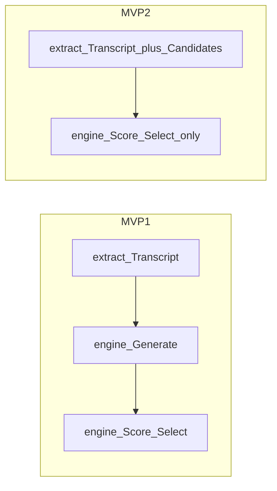

# Q-Agent MVP2 — (역사) 범위 · 계약 방향 · 브랜치 운영

> **ARCHIVE (2026-09-18)**  
> TypeScript `extract`/`engine` 분리는 **채택되지 않았고 코드에서 제거**되었습니다.  
> 현재 런타임·배포는 [INFRASTRUCTURE.md](./INFRASTRUCTURE.md) / [README.md](../README.md)만 따르세요.  
> 아래 본문은 당시 브랜치 논의 기록입니다.
>
> 통합 브랜치(당시): **`develop_2`**  
> 관련(당시): [KICKOFF.md](./KICKOFF.md), [INFRASTRUCTURE.md](./INFRASTRUCTURE.md)

---

## 1. MVP1 vs MVP2

| | MVP1 (`develop` / `main`) | MVP2 (`develop_2`) |
| --- | --- | --- |
| extract | Transcript만 반환 | Transcript + **후보 질문 생성** |
| engine | Generate + Guard/Filter + Score + Select | **Score/Select만** (입력 후보 → 최종 ≤3 또는 rejected) |
| 프론트 BFF | extract → diagnose(transcript) | extract 후보를 diagnose 요청에 전달 |
| LLM 책임 | 생성·채점이 엔진에 집중 | 생성은 extract, 채점·선발은 engine |



### MVP2 Done (목표)

- [ ] extract가 후보 N개(계약으로 확정, MVP1 엔진 Generate 슬롯 정책을 이관)를 반환
- [ ] engine은 Generate 없이 후보 → Guard/Filter/Score/Select만 수행
- [ ] web BFF가 후보를 diagnose에 전달
- [ ] `npm run smoke`로 extract→diagnose E2E 통과
- [ ] 엔진 Generate 폴백 없음 (책임 재혼합 금지)

### 의도적 제외 (MVP2)

- generate/select API 물리 분리 시각화 (후속)
- 히든 프로파일, QDM/Toulmin 고도화
- depth/tone 후단 LLM 재작성

---

## 2. 계약 방향 (Contract-First)

구현 PR보다 **계약 PR을 먼저** `develop_2`에 머지한다.

권장 순서:

1. 브랜치 `chore/contracts-mvp2-candidates` → base **`develop_2`**
2. `packages/contracts`에 후보 질문 타입 추가
3. extract 응답 / diagnose 요청에 `candidates`(필드명은 계약 PR에서 확정) 추가
4. `fixtures/`에 MVP2 예제 JSON 추가
5. **이 PR에는 서비스 구현 코드 넣지 않음**

스키마 원칙:

- MVP2 경로에서 후보 필드는 **필수**
- engine 쪽 Generate 폴백 없음
- 파이프라인 통계: extract = 생성 수, engine = filter/score/select 수

---

## 3. 브랜치 토폴로지

```text
main                         ← 데모/배포 (컷오버 전 = MVP1만)
 ├── develop                 ← MVP1만. MVP1 feat/* 머지 대상
 │    └── hotfix/*           ← 데모 깨짐 → develop → main
 └── develop_2               ← MVP2만. 이 문서의 통합선 (현재 브랜치)
      ├── chore/contracts-mvp2-candidates
      ├── feat/extract-generate-candidates
      ├── feat/engine-select-only
      └── feat/front-mvp2-pipeline
```

| 브랜치 | 머지하는 것 |
| --- | --- |
| `develop` | MVP1에 해당하는 모듈 변경 |
| `develop_2` | MVP2에 해당하는 모듈 변경 |
| `main` | 배포 가능 상태만 (`develop` 또는 컷오버 시 `develop_2`) |

---

## 4. 운영 규칙

1. **MVP2 코드는 `develop`에 넣지 않는다.** PR base는 항상 `develop_2`.
2. **MVP1 핫픽스:** `develop` → `main`, 같은 수정을 **`develop` → `develop_2` 일방향** 동기화. (`develop_2` → `develop` 금지)
3. PR에 base를 명시: `base: develop` 또는 `base: develop_2`.
4. 한 PR = 한 목적. contracts / extract / engine / front를 섞지 않는다.
5. 커밋 prefix: `chore(contracts):` / `feat(extract):` / `feat(engine):` / `feat(front):`
6. 머지 전: 해당 모듈 `/health` + fixture 스모크.

### 역할별 feat (계약 머지 후, 병렬)

| 브랜치 | 담당 | 내용 |
| --- | --- | --- |
| `feat/extract-generate-candidates` | 추출 | `/v1/extract`에서 후보 N개 생성 |
| `feat/engine-select-only` | 엔진 | Generate 제거, 입력 후보 → Guard/Filter/Score/Select |
| `feat/front-mvp2-pipeline` | 프론트 | BFF: extract 후보 → diagnose |

extract ↔ engine은 **contracts + fixtures만 공유**하고 서로 머지 대기하지 않는다.  
`develop_2`에 하루 1회 이상 머지하는 것을 목표로 한다.

### 핫픽스 동기화

```text
hotfix → develop → main          (데모 즉시)
       ↘ develop_2               (같은 날 이식, 충돌은 develop_2에서 해결)
```

---

## 5. 컷오버 (`main`에 이미 `develop`이 있는 경우)

`develop` → `main` 이후에 **`develop_2` → `main` 해도 된다.** 순서는 고정:

1. **`develop` → `develop_2`** (핫픽스 흡수 — 생략 금지)
2. `develop_2`에서 `npm run smoke` + E2E 통과
3. **`develop_2` → `main`** (MVP2 공식 전환)
4. `develop` → `develop_mvp1`로 보관(또는 삭제) 후, `develop_2`를 `develop`로 rename
5. 이후 단일 `develop` 운영

---

## 6. 구현 시 주의

- Generate 프롬프트·operator/category 슬롯 로직은 엔진에서 extract로 **이동**. 양쪽에 복제 유지 금지.
- MVP1 엔진 파이프라인 문서: [ENGINE_ROADMAP.md](./ENGINE_ROADMAP.md) — MVP2에서는 Score/Select 구간을 유지하고 Generate 입력을 extract 후보로 교체.
- `main`에는 MVP2 부분 머지 금지. 컷오버 때만 `develop_2` 통째로.

---

## 7. 체크리스트

- [ ] MVP1을 `develop` → `main` 반영 (데모 유지)
- [x] `develop`에서 `develop_2` 생성 + 본 문서
- [ ] `chore/contracts-mvp2-candidates` → `develop_2`
- [ ] extract / engine / front feat → `develop_2`
- [ ] develop 핫픽스 → develop_2 동기화
- [ ] smoke 후 `develop_2` → `main` 컷오버, develop 재정렬
